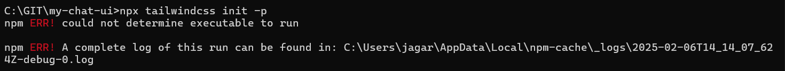

# Log: 2025-02-06

## Completed Tasks:

### **Project Initialization**

1. **Created a new Vite project with React and TypeScript**

   - Command: `npm create vite@latest my-chat-ui --template react-ts`
   - Selected React and TypeScript for the project setup.
   - 

2. **Installed necessary dependencies**
   - Command: `npm install`
   - Installed required packages for the project.
   - 

### **Node.js Upgrade**

3. **Upgraded Node.js to version 22 due to warning messages**
   - Downloaded and installed `nvm-windows` from GitHub.
   - Restarted the terminal after installation.
   - Ran the command: `nvm install 22`
   - 

### **Tailwind CSS Installation & Configuration**

4. **Checked Tailwind CSS installation after an error occurred**

   - Command: `npm list tailwindcss`
   - Verified that Tailwind CSS was installed correctly.
   - 

5. **Identified differences between Tailwind v4 and v3 installation methods**

   - Decided to use Tailwind v3 due to better documentation and support.
   - Commands executed:
     ```sh
     npm uninstall tailwindcss @tailwindcss/vite
     npm install -D tailwindcss@3 postcss autoprefixer
     npx tailwindcss init -p
     ```
   - 

6. **Updated Tailwind configuration**

   - Edited `tailwind.config.js` to include:
     ```js
     content: ["./index.html", "./src/**/*.{js,ts,jsx,tsx}"];
     ```

7. **Updated `src/index.css` to include Tailwind directives**

   ```css
   @tailwind base;
   @tailwind components;
   @tailwind utilities;
   ```

8. **Ran the development server to confirm Tailwind CSS functionality**
   - Command: `npm run dev`
   - Verified that Tailwind CSS was working correctly.
   - 

### **Chat Form Component Implementation**

9. **Installed MUI package for UI components**

   - Command:
     ```sh
     npm install @mui/material @emotion/react @emotion/styled
     ```

10. **Created `ChatForm.tsx` component**
    - Implemented a chat input field with a send button using MUI.
    - 
