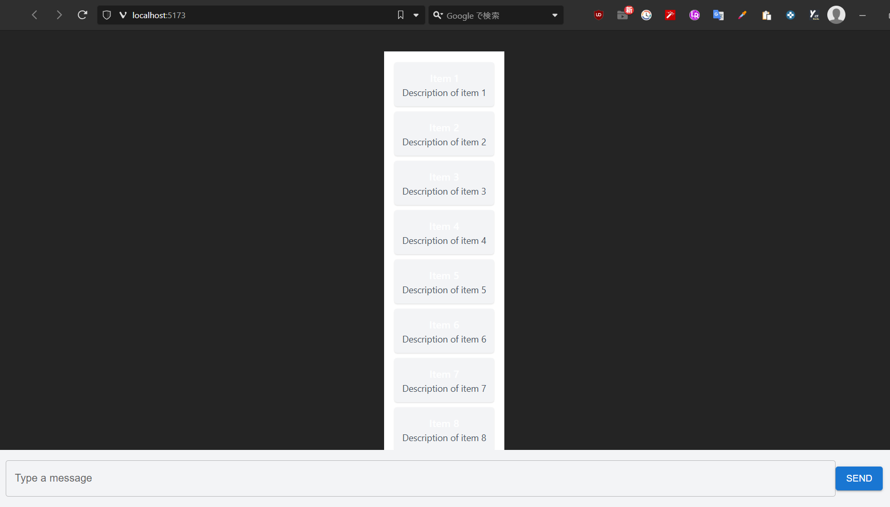
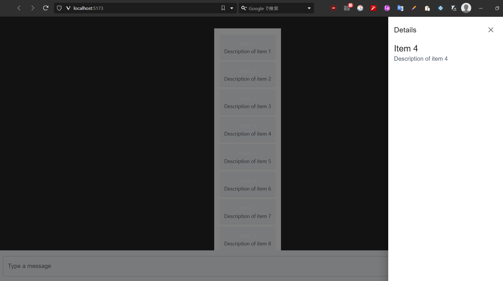
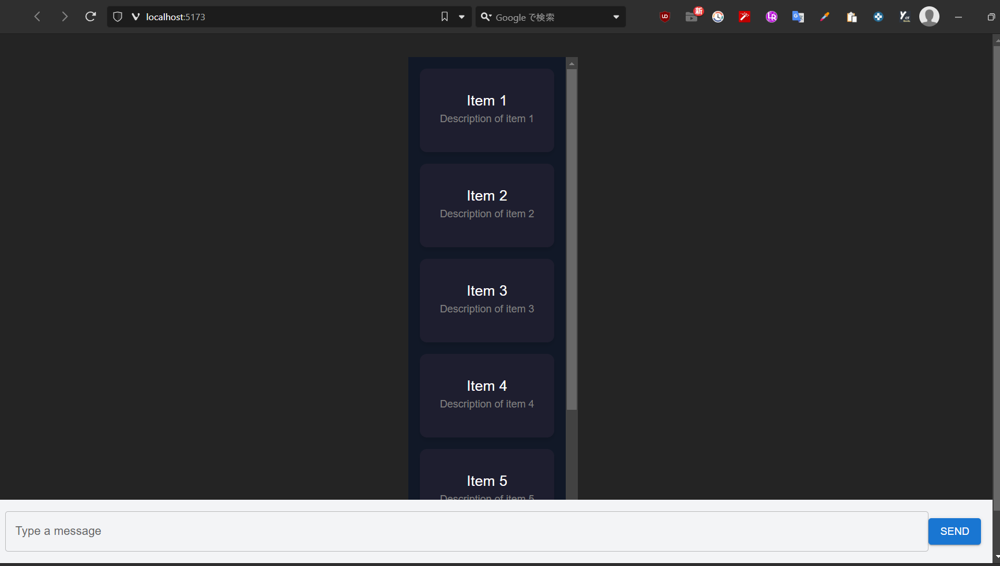

# Log: 2025-02-07

## Completed Tasks:

### **Created DataList.tsx**

1. **Implemented a scrollable data list in the browser**
   - Verified that the list is scrollable and properly displayed.
   - 

### **Resolved Module Not Found Error in Sidebar.tsx**

2. **Encountered an error while creating Sidebar.tsx**
   ```
   Cannot find module '@mui/icons-material/Close' or its corresponding type declarations.ts(2307)
   ```
3. **Installed the missing package to resolve the error:**

   ```sh
   npm install @mui/icons-material
   ```

4. **Verified that clicking on a data list item displays the sidebar correctly in the browser**
   - 

### **Selected DashdarkX as Reference Template**

5. **Chose the following template for design inspiration:**
   - 🔗 [DashdarkX Template](https://themewagon.com/themes/dashdarkx/)

### **Updated DataList.tsx with MUI Card & Dark Theme**

6. **Installed MUI for Cards:**
   ```sh
   npm install @mui/material
   ```
7. **Modified `DataList.tsx` with the following changes:**

   - Wrapped list items in MUI `Card`
   - Applied a dark theme background and text colors
   - Added a hover effect with shadow and elevation

8. **Verified the new DataList design in the browser**
   - 
