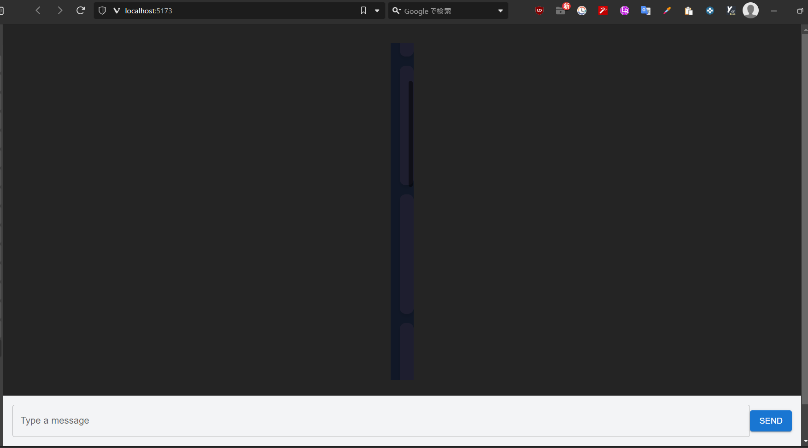
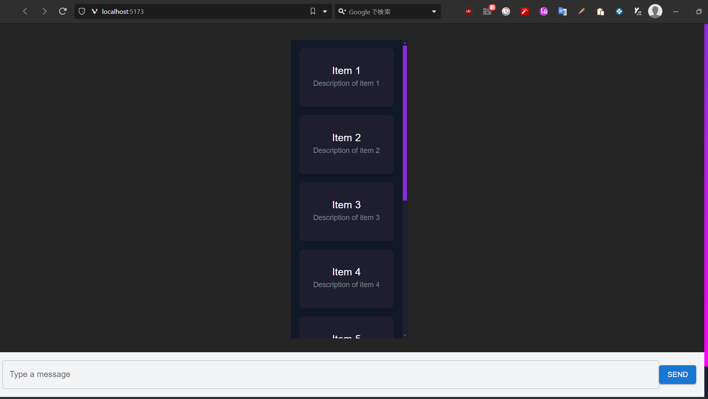
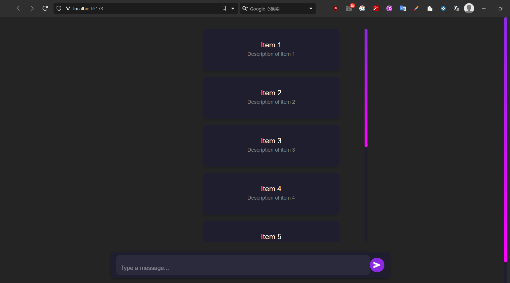

# Log: 2025-02-08

## Completed Tasks:

### **Modified Scrollbar Design**

1. **Applied SimpleBar to DataList.tsx:**

   - Initially applied SimpleBar to the DataList.tsx component.
   - However, it was decided to abandon the idea as it caused the Card’s width to become too narrow.
   - 

2. **Alternative scrollbar solution:**

   - Added `::-webkit-scrollbar` to `index.css`.
   - Verified that the scrollbar was correctly updated.
   - 

3. **Adjusted list size:**
   - Increased the size of the list to ensure the layout remains visually appealing.
   - 
