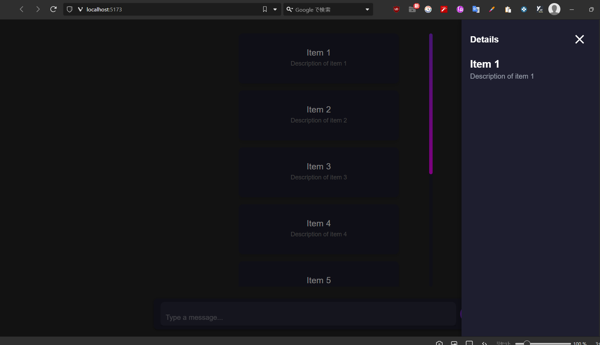
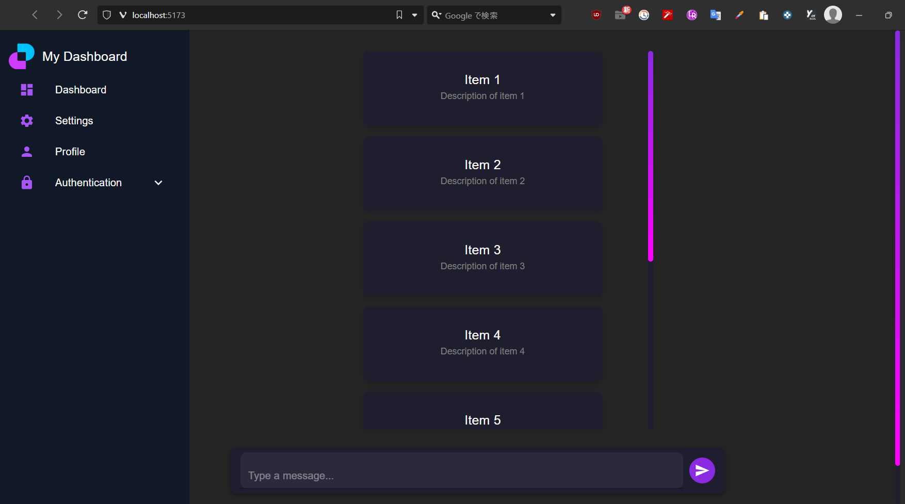
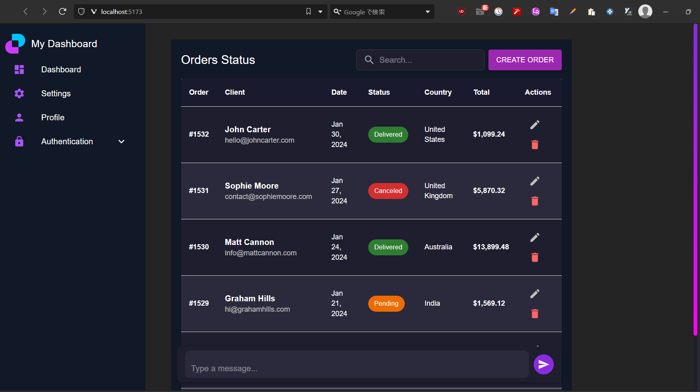
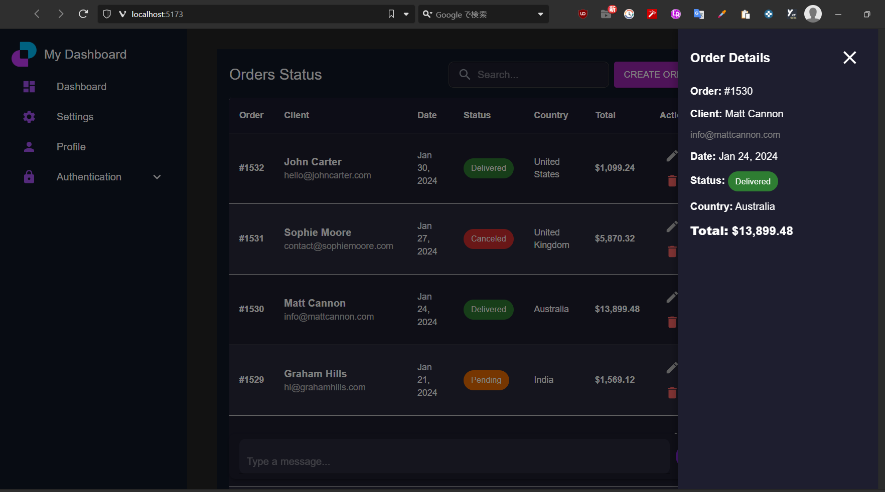
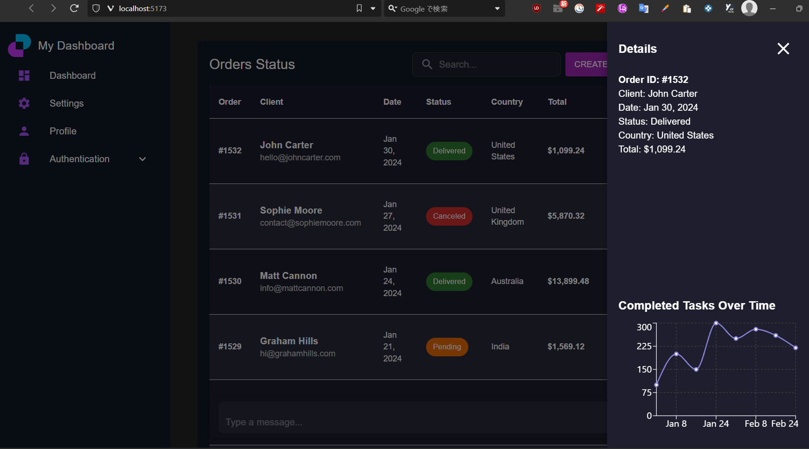

# Log: 2025-02-09

## Completed Tasks:

### **Improved Chat Form Design**

1. **Improved the design of the chat form:**
   - Enhanced the user interface for a cleaner and more modern look.
   - 

### **Improved Sidebar Design**

2. **Updated the sidebar design:**
   - Made adjustments to ensure a more cohesive and aesthetically pleasing layout.
   - 

### **Added Menu Bar**

3. **Added a menu bar:**
   - Integrated a menu bar for better navigation within the application.
   - 

### **Modified DataList Design to Orders Status Style**

4. **Revised the DataList design to follow the Orders Status style:**
   - Updated the design to match the look and feel of the Orders Status component.
   - 

### **Updated DataList to Display Details in Sidebar**

5. **Changed the DataList to display item details in the sidebar:**
   - Clicking on a DataList item now shows detailed information in the sidebar.
   - 

### **Displayed Line Chart in Sidebar**

6. **Implemented and displayed a line chart in the sidebar:**
   - Integrated a line chart to visualize trends and data.
   - 
